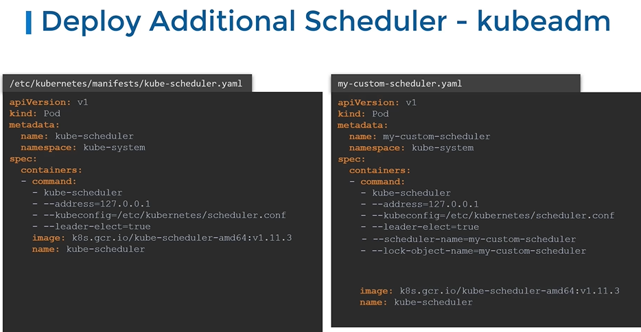

# Multiple Schedulers

- Take me to [Video Tutorial](https://kodekloud.com/topic/multiple-schedulers/)

In this section, we will take a look at multiple schedulers

## Custom Schedulers

- Your kubernetes cluster can schedule multiple schedulers at the same time.

  
  
## Deploy additional scheduler

- Download the binary

  ```
  wget https://storage.googleapis.com/kubernetes-release/release/v1.12.0/bin/linux/amd64/kube-scheduler
  ```

  
  
## Deploy additional scheduler - kubeadm

  
  
- To create a scheduler pod

    ```
    kubectl create -f my-custom-scheduler.yaml
    ```
  
## View Schedulers

- To list the scheduler pods

  ```
  kubectl get pods -n kube-system
  ```

## Use the Custom Scheduler

- Create a pod definition file and add new section called **`schedulerName`** and specify the name of the new scheduler

  ```
  apiVersion: v1
  kind: Pod
  metadata:
    name: nginx
  spec:
    containers:
    - image: nginx
      name: nginx
    schedulerName: my-custom-scheduler
  ```

  
  
- To create a pod definition

  ```
  kubectl create -f pod-definition.yaml
  ```

- To list pods

  ```
  kubectl get pods
  ```

## View Events

- To view events

  ```
  kubectl get events
  ```

  
  
## View Scheduler Logs

- To view scheduler logs

  ```
  kubectl logs my-custom-scheduler -n kube-system
  ```

  
  
#### K8s Reference Docs

- <https://kubernetes.io/docs/tasks/extend-kubernetes/configure-multiple-schedulers/>
  