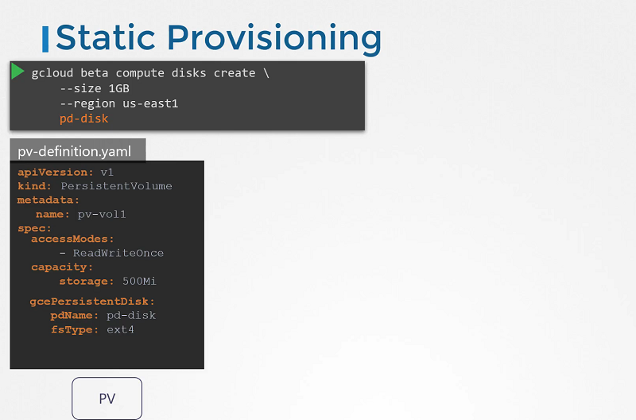
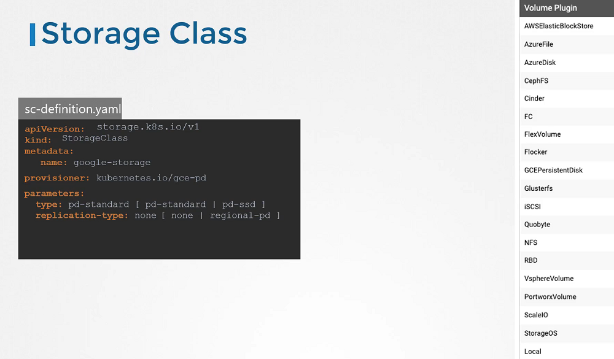

# Storage Class

- Take me to [Lecture](https://kodekloud.com/topic/storage-class/)

In this section, we will take a look at **Storage Class**

- We discussed about how to create Persistent Volume and Persistent Volume Claim and We also saw that how to use into the Pod's volume to claim that volume space.
- We created Persistent Volume but before this if we are taking a volume from Cloud providers like GCP, AWS, Azure. We need to first create disk in the Google Cloud as an example.
- We need to create manually each time when we define in the Pod definition file. that's called **Static Provisioning**.

#### Static Provisioning



#### Dynamic Provisioning


- Now we have a Storage Class, So we no longer to define Persistent Volume. It will create automatically when a Storage Class is created. It's called **Dynamic Provisioning**.

```
sc-definition.yaml

apiVersion: storage.k8s.io/v1
kind: StorageClass
metadata:
   name: google-storage
provisioner: kubernetes.io/gce-pd
```

#### Create a Storage Class

```
$ kubectl create -f sc-definition.yaml
storageclass.storage.k8s.io/google-storage created
```

#### List the Storage Class

```
$ kubectl get sc
NAME             PROVISIONER            RECLAIMPOLICY   VOLUMEBINDINGMODE   ALLOWVOLUMEEXPANSION   AGE
google-storage   kubernetes.io/gce-pd   Delete          Immediate           false                  20s
```

#### Create a Persistent Volume Claim

```
pvc-definition.yaml

kind: PersistentVolumeClaim
apiVersion: v1
metadata:
  name: myclaim
spec:
  accessModes: [ "ReadWriteOnce" ]
  storageClassName: google-storage       
  resources:
   requests:
     storage: 500Mi
```

```
kubectl create -f pvc-definition.yaml

```

#### Create a Pod

```
pod-definition.yaml

apiVersion: v1
kind: Pod
metadata:
  name: mypod
spec:
  containers:
    - name: frontend
      image: nginx
      volumeMounts:
      - mountPath: "/var/www/html"
        name: web
  volumes:
    - name: web
      persistentVolumeClaim:
        claimName: myclaim
```

```
kubectl create -f pod-definition.yaml
```

#### Provisioner



#### Kubernetes Storage Class Reference Docs

- <https://kubernetes.io/docs/concepts/storage/storage-classes/>
- <https://cloud.google.com/kubernetes-engine/docs/concepts/persistent-volumes#storageclasses>
- <https://docs.aws.amazon.com/eks/latest/userguide/storage-classes.html>
