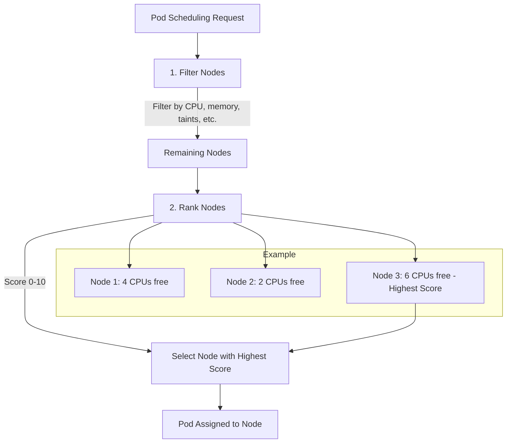

# Kubernetes Notes

## 🗄️ etcd

`etcd` is a consistent and highly-available key-value store used as Kubernetes' backing store for all cluster data.

### Key Concepts

- **Key-Value Store**: Unlike relational databases, `etcd` stores data in a flexible format like JSON or YAML.
- **Cluster State**: It is the single source of truth for all Kubernetes cluster configuration and state.

### Deployment

`etcd` can be deployed manually or as a pod managed by `kubeadm`.

- **Manual Setup**:

  ```bash
  # Download etcd binaries
  wget -q --https-only "https://github.com/coreos/etcd/releases/download/v3.3.9/etcd-v3.3.9-linux-amd64.tar.gz"
  
  # Example service configuration
  ExecStart=/usr/local/bin/etcd \
    --name ${ETCD_NAME} \
    --cert-file=/etc/etcd/kubernetes.pem \
    --key-file=/etc/etcd/kubernetes-key.pem \
    --peer-cert-file=/etc/etcd/kubernetes.pem \
    --peer-key-file=/etc/etcd/kubernetes-key.pem \
    --trusted-ca-file=/etc/etcd/ca.pem \
    --peer-trusted-ca-file=/etc/etcd/ca.pem \
    --peer-client-cert-auth \
    --client-cert-auth \
    --initial-advertise-peer-urls https://${INTERNAL_IP}:2380 \
    --listen-peer-urls https://${INTERNAL_IP}:2380 \
    --listen-client-urls https://${INTERNAL_IP}:2379,https://127.0.0.1:2379 \
    --advertise-client-urls https://${INTERNAL_IP}:2379 \
    --initial-cluster-token etcd-cluster-0 \
    --initial-cluster controller-0=https://${CONTROLLER0_IP}:2380,controller-1=https://${CONTROLLER1_IP}:2380 \
    --initial-cluster-state new \
    --data-dir=/var/lib/etcd
  ```

- **kubeadm Setup**:
  `etcd` runs as a static pod in the `kube-system` namespace.

  ```bash
  kubectl get pods -n kube-system
  ```

### `etcdctl` Commands

`etcdctl` is the command-line client for `etcd`.

**API Version**:

```bash
export ETCDCTL_API=3
```

**Commands**:

- **Set a key**: `./etcdctl put key1 value1`
- **Get a key**: `./etcdctl get key1`
- **View all keys**: `kubectl exec etcd-master -n kube-system -- etcdctl get / --prefix --keys-only`

---

## 🧭 Kube API Server

The API Server is the front-end for the Kubernetes control plane. It exposes the Kubernetes API and is responsible for processing and validating requests.

### Request Lifecycle

1. **Authentication & Authorization**: Validates the user and request.
2. **Data Retrieval**: Fetches data from `etcd`.
3. **Coordination**: Interacts with other components like the Scheduler and Kubelet.

### Deployment

- **kubeadm**: Runs as a pod in the `kube-system` namespace.
- **Manual**:

  ```bash
  wget https://storage.googleapis.com/kubernetes-release/release/v1.13.0/bin/linux/amd64/kube-apiserver
  
  # Example systemd service
  ExecStart=/usr/local/bin/kube-apiserver \
    --advertise-address=${INTERNAL_IP} \
    --allow-privileged=true \
    --authorization-mode=Node,RBAC \
    --etcd-servers=https://127.0.0.1:2379 \
    # ... other flags
  ```

---

## 🧠 Kube Controller Manager

The Controller Manager runs controller processes. Each controller is a background loop that watches the state of the cluster and makes changes to move the current state towards the desired state.

### Controllers

- **Node Controller**: Manages nodes, including heartbeats and eviction.
- **Replication Controller**: Ensures the correct number of pod replicas.
- **And many more...** (`deployment`, `service`, `namespace`, etc.)

### Configuration

- **Enable/Disable Controllers**: Use the `--controllers` flag.

  ```bash
  # Disable the tokencleaner controller
  --controllers=*, -tokencleaner
  ```

---

## 🚢 Kubelet

The Kubelet is an agent that runs on each node in the cluster. It makes sure that containers are running in a Pod.

- **Responsibilities**:
  - Registers the node with the cluster.
  - Manages pod lifecycle (start, stop, health checks).
  - Reports node and pod status to the API server.

---

## scheduler

The scheduler watches for newly created Pods that have no Node assigned, and for every Pod that the scheduler discovers, it becomes responsible for finding the best Node for that Pod to run on.



---

## 🧱 Pods

A Pod is the smallest and simplest unit in the Kubernetes object model that you create or deploy.

- **Encapsulation**: A Pod can contain one or more containers that share storage and network resources.
- **Scaling**: You scale an application by creating more Pods, not by adding containers to an existing Pod.

### Creating a Pod

```bash
# Run a single-container pod
kubectl run nginx --image=nginx

# Get pod status
kubectl get pods
```

---

## 🔁 ReplicaSets

A ReplicaSet's purpose is to maintain a stable set of replica Pods running at any given time.

### YAML Definition

```yaml
apiVersion: apps/v1
kind: ReplicaSet
metadata:
  name: myapp-replicaset
spec:
  replicas: 3
  selector:
    matchLabels:
      app: myapp
  template:
    metadata:
      labels:
        app: myapp
    spec:
      containers:
      - name: nginx-container
        image: nginx
```

### Scaling

- **Declaratively**: Update the `replicas` field in the YAML and apply it.

  ```bash
  kubectl replace -f replicaset-definition.yml
  ```

- **Imperatively**: Use the `kubectl scale` command.

  ```bash
  kubectl scale --replicas=6 replicaset/myapp-replicaset
  ```

---

## 🚀 Common `kubectl` Commands

### Pods & Deployments

- **Create an NGINX Pod**:

  ```bash
  kubectl run nginx --image=nginx
  ```

- **Generate Pod Manifest (YAML)**:

  ```bash
  kubectl run nginx --image=nginx --dry-run=client -o yaml
  ```

- **Create a Deployment**:

  ```bash
  kubectl create deployment --image=nginx nginx
  ```

- **Generate Deployment Manifest and Save to File**:

  ```bash
  kubectl create deployment --image=nginx nginx --dry-run=client -o yaml > nginx-deployment.yaml
  ```

- **Create from file**:

  ```bash
  kubectl create -f nginx-deployment.yaml
  ```

- **Create a deployment with replicas**:

  ```bash
  kubectl create deployment --image=nginx nginx --replicas=4 --dry-run=client -o yaml > nginx-deployment.yaml
  ```

# Kubernetes Namespaces — Key Concepts & Commands

Namespaces in Kubernetes provide logical isolation for cluster resources, enabling better organization, access control, and resource management.

---

## 🧠 Core Concepts

- **Namespace Analogy**: Like houses with people sharing first names, namespaces isolate resources to avoid conflicts.
- **Default Namespace**: Automatically used when no namespace is specified.
- **System Namespaces**:
  - `kube-system`: Core system components (e.g., DNS, network).
  - `kube-public`: Publicly accessible resources.

---

## 📦 Resource Isolation

- Resources in the same namespace can refer to each other by name.
- Cross-namespace communication requires fully qualified DNS names:

  ```
  db-service.dev.svc.cluster.local
  ```

## 🔧 kubectl Commands

### List Pods

```bash
kubectl get pods                      # default namespace
kubectl get pods --namespace=kube-system
kubectl get pods --all-namespaces
```

### Create Pod

```bash
kubectl create -f pod-definition.yml                      # default namespace
kubectl create -f pod-definition.yml --namespace=dev      # specific namespace
```

### Pod YAML (with and without namespace)

```yaml
# Without namespace
apiVersion: v1
kind: Pod
metadata:
  name: myapp-pod
  labels:
    app: myapp
    type: front-end
spec:
  containers:
    - name: nginx-container
      image: nginx

# With namespace
apiVersion: v1
kind: Pod
metadata:
  name: myapp-pod
  namespace: dev
  labels:
    app: myapp
    type: front-end
spec:
  containers:
    - name: nginx-container
      image: nginx
```

---

## 🏗️ Namespace Management

### Create Namespace

```yaml
# namespace-dev.yml
apiVersion: v1
kind: Namespace
metadata:
  name: dev
```

```bash
kubectl create -f namespace-dev.yml
kubectl create namespace dev
```

### Set Default Namespace for Context

```bash
kubectl config set-context $(kubectl config current-context) --namespace=dev
```

---

## 📊 Resource Quotas

### Define ResourceQuota

```yaml
# compute-quota.yaml
apiVersion: v1
kind: ResourceQuota
metadata:
  name: compute-quota
  namespace: dev
spec:
  hard:
    pods: "10"
    requests.cpu: "4"
    requests.memory: 5Gi
    limits.cpu: "10"
    limits.memory: 10Gi
```

```bash
kubectl create -f compute-quota.yaml
```

---

## ✅ Summary

Namespaces:

- Enable multi-environment clusters (e.g., dev, prod).
- Provide isolation and resource control.
- Are essential for scalable, secure Kubernetes operations.

Practice using namespaces and quotas to master cluster segmentation.

📚 Source: [KodeKloud Notes on Namespaces](https://notes.kodekloud.com/docs/CKA-Certification-Course-Certified-Kubernetes-Administrator/Core-Concepts/Namespaces)

```
